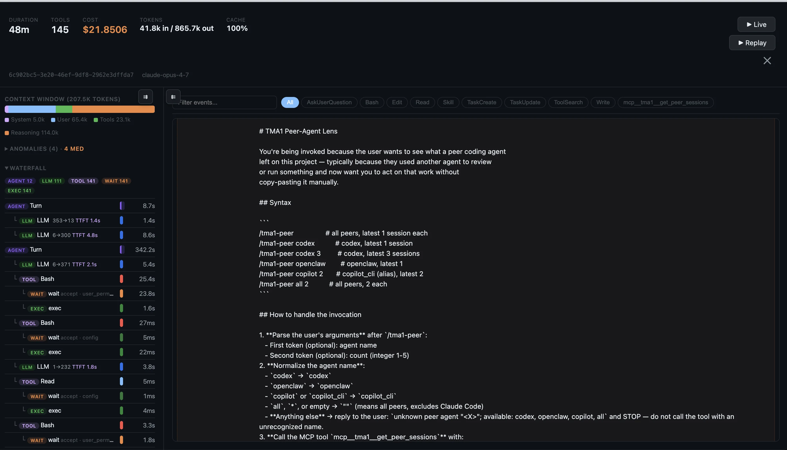

# TMA1

> *"Your agent runs. TMA1 remembers."*

Local-first observability for AI agents, with a built-in dashboard.
See what your agents cost, how long they take, and whether they're doing anything weird. All data stays on your machine.
One binary, no cloud account, no Docker, no Grafana.

Named after TMA-1 (Tycho Magnetic Anomaly-1) from *2001: A Space Odyssey*:
the monolith buried on the moon, silently recording everything until you dig it out.


## What's in it

Six dashboard views, picked automatically from whatever data shows up:

| View | Tabs | Data Source |
|------|------|-------------|
| **Claude Code** | Overview, Tools, Cost, Anomalies, Sessions→ | OTel metrics + logs |
| **Codex** | Overview, Tools, Cost, Anomalies, Sessions→ | OTel logs + metrics |
| **Copilot CLI** | Overview, Tools, Cost, Sessions→ | JSONL transcripts (`~/.copilot/session-state/`) |
| **OpenClaw** | Overview, Sessions, Traces, Cost, Security | OTel traces + metrics |
| **OTel GenAI** | Overview, Traces, Cost, Security, Search | OTel traces (gen_ai semantic conventions) |
| **Sessions** | Sessions, Search | Hooks + JSONL transcripts (Claude Code, Codex, Copilot CLI) |
| **Prompts** | Overview, Prompts, Patterns | Heuristic scoring + optional LLM-as-judge |

Sessions→ links in Claude Code, Codex, and Copilot CLI views navigate to the unified Sessions view.

Each view gives you:
- Token counts, cost, and burn rate per model
- p50/p95 latency per model
- Activity heatmap over time
- Anomalies tab that flags expensive requests, errors, and slow tools
- Session replay with full conversation timeline
- Search across all sessions by keyword
- Prompt evaluation with heuristic scoring and optional LLM-as-judge
- SQL access on port 14002, or the built-in query API
- Settings panel to configure LLM API key and server options at runtime

OpenClaw and OTel GenAI views also have a Security tab (shell commands, prompt injection, webhook errors).

## Closing the agent loop

Observability is one half; the other half is feeding what TMA1 sees back into the agent's reasoning loop so it can do better work next turn. v2 ships two channels for this:

**Push channel — hooks inject context into the agent's prompt stream.** Five hook events are wired to TMA1 — `UserPromptSubmit` prepends a session digest before each turn, `SessionStart` orients a fresh session with prior state and external changes, `PreCompact` carries critical state through context compaction, `PostToolUse` appends per-tool anomaly notes when needed, and `Stop` blocks termination on unresolved high-severity issues. **Claude Code** (`tma1-server install --adapter claude-code`) wires all five into `~/.claude/settings.json`. **Codex** (`tma1-server install --adapter codex`) wires the four that exist in Codex's hook catalogue — `PreCompact` is CC-only — into `~/.codex/hooks.json`. Reverse with `tma1-server uninstall --adapter <name>` whenever you want to back out — surgical removal of hooks, MCP entry, skills, and the `<!-- tma1:start -->` block; user-owned siblings stay intact. The hook script is request–response: it POSTs the event, and whatever the server returns becomes the injection content (raw stdout for CC; wrapped in Codex's `hookSpecificOutput.additionalContext` shape for Codex). Fail-safe: 500 ms client timeout on Unix and 1 s on Windows — both sit above the server-side `hookInjectionTimeout = 300 ms` cap, so a slow path falls back to empty stdout. The agent never blocks on TMA1.

**Pull channel — seven MCP stdio tools the agent can call on demand.** `get_context_bundle` is the aggregate entry point; `get_session_state` returns the full action history; `get_anomalies` lists currently-active issues; `get_external_changes` shows what changed on disk outside the agent; `get_build_status` reports the last build watcher state; `get_project_state` is the static index of the project's structure; `get_peer_sessions` lets one agent read recent sessions from the other agents on the same project (Claude Code ↔ Codex ↔ OpenClaw ↔ Copilot CLI — symmetric). The MCP server is registered in each agent's own config (`~/.claude.json` for CC, `~/.codex/config.toml` `[mcp_servers.tma1]` for Codex) by the adapter installer.

**Anomaly engine.** Six rules run on every Detect, with a per-session 10-minute suppression layer plus resolution checks (e.g. R-stale-view auto-clears when the agent re-reads the modified file). Each anomaly routes to a specific channel — `stop_block` for HIGH-severity build/test issues, `user_prompt_submit` for stale views and human-modified-during-session — so the same finding never injects twice. Three validation gates ship: `/api/anomalies/budget` (≤ 5 emits/kind/day target), `/api/anomalies/follow-rate` (≥ 30% target), and offline precision via the `tma1_anomaly_emits` table.

**Cross-agent collaboration.** Inside Claude Code, `/tma1-peer codex` pulls Codex's most recent session content on the current project and feeds it directly into Claude's context — no copy-paste between terminals. `/tma1-peer copilot 2` works the same way for Copilot CLI; `/tma1-peer` alone returns the latest session from every peer agent.

Setup is one command per agent — both are idempotent:

```bash
# Claude Code: writes hooks + MCP + /tma1-peer skill + CLAUDE.md/AGENTS.md block.
curl -fsSL https://tma1.ai/install.sh | TMA1_ADAPTER=claude-code bash

# Codex: writes hooks + MCP + tma1-peer skill + AGENTS.md block in Codex's
# native config shape (~/.codex/hooks.json, ~/.codex/config.toml,
# ~/.agents/skills/tma1-peer/).
curl -fsSL https://tma1.ai/install.sh | TMA1_ADAPTER=codex bash
```

Stale-sweep is scoped to a `tma1-` owner prefix on both adapters, so personal skills + commands sitting alongside ours in `~/.claude/{skills,commands}/` or `~/.agents/skills/` are never touched. Re-running install only updates files that drifted.

See [docs/mcp-tools.md](docs/mcp-tools.md), [docs/hooks.md](docs/hooks.md), and [docs/anomalies.md](docs/anomalies.md) for the deeper reference.




## Quick Install

```bash
# macOS / Linux
curl -fsSL https://tma1.ai/install.sh | bash

# Windows (PowerShell)
irm https://tma1.ai/install.ps1 | iex
```

To wire TMA1 into Claude Code (hooks + MCP server + `/tma1-peer` skill) in the same step:

```bash
# macOS / Linux
curl -fsSL https://tma1.ai/install.sh | TMA1_ADAPTER=claude-code bash

# Windows
$env:TMA1_ADAPTER = 'claude-code'; irm https://tma1.ai/install.ps1 | iex
```

Or build from source:

```bash
git clone https://github.com/tma1-ai/tma1.git
cd tma1
make build
```

## Agent Install

Ask your agent:

> Read https://tma1.ai/SKILL.md and follow the instructions to install and configure TMA1 for your AI agent

## Quick Start

```bash
# Start TMA1
tma1-server

# Configure your agent to send OTel data (protobuf required):

# Claude Code — add to ~/.claude/settings.json:
#   "env": {
#     "OTEL_EXPORTER_OTLP_ENDPOINT": "http://localhost:14318/v1/otlp",
#     "OTEL_EXPORTER_OTLP_PROTOCOL": "http/protobuf",
#     "OTEL_METRICS_EXPORTER": "otlp",
#     "OTEL_LOGS_EXPORTER": "otlp"
#   }

# OpenClaw (sends traces)
openclaw config set diagnostics.otel.endpoint http://localhost:14318/v1/otlp

# GitHub Copilot CLI — zero config!
# TMA1 auto-discovers session data from ~/.copilot/session-state/
# Just start tma1-server and use Copilot CLI as usual.

# Codex — add to ~/.codex/config.toml:
#   [otel]
#   log_user_prompt = true
#
#   [otel.exporter.otlp-http]
#   endpoint = "http://localhost:14318/v1/logs"
#   protocol = "binary"
#
#   [otel.trace_exporter.otlp-http]
#   endpoint = "http://localhost:14318/v1/traces"
#   protocol = "binary"
#
#   [otel.metrics_exporter.otlp-http]
#   endpoint = "http://localhost:14318/v1/metrics"
#   protocol = "binary"
#
#   Then restart Codex.

# Any OTel SDK
OTEL_EXPORTER_OTLP_ENDPOINT=http://localhost:14318/v1/otlp \
OTEL_EXPORTER_OTLP_PROTOCOL=http/protobuf \
your-agent

# Open the dashboard
open http://localhost:14318
```

## How It Works

```
Agent (Claude Code / Codex / Copilot CLI / OpenClaw / any GenAI app)
    │  OTLP/HTTP + JSONL transcripts
    ▼
tma1-server  (port 14318)
    │  receives + stores OTel data
    │  watches JSONL session files
    │  derives per-minute aggregations
    │  serves dashboard UI
    ▼
Browser dashboard (embedded in the binary)
```

One process, one binary. First start creates `~/.tma1/` and you're good to go. By default, nothing leaves your machine. If you enable optional LLM prompt evaluation (via Settings or `TMA1_LLM_API_KEY`), prompt content is sent to the configured provider (Anthropic/OpenAI) for scoring.

Settings configured in the dashboard are saved to `~/.tma1/settings.json`. Environment variables always take priority over the settings file.

## OTLP Endpoints

Agents send OTLP data to tma1-server:

```text
http://localhost:14318/v1/otlp          # Wildcard OTLP (recommended)
http://localhost:14318/v1/traces        # Direct signal: traces
http://localhost:14318/v1/metrics       # Direct signal: metrics
http://localhost:14318/v1/logs          # Direct signal: logs
```

Codex requires separate per-signal endpoints; other agents can use the single `/v1/otlp` base.

## API Endpoints

| Endpoint | Method | Description |
|----------|--------|-------------|
| `/health` | GET | Liveness check |
| `/status` | GET | Backend reachability |
| `/api/query` | POST | SQL proxy (`{"sql": "SELECT ..."}`) |
| `/api/prom/*` | GET/POST | Prometheus API proxy (PromQL) |
| `/api/evaluate` | GET/POST | LLM prompt evaluation (availability check / single prompt) |
| `/api/evaluate/summary` | POST | LLM batch summary (sampled prompts) |
| `/api/settings` | GET/POST | Read/write server settings (LLM config, log level, TTL) |
| `/api/hooks` | POST | Hook event ingest from agent adapters (Claude Code) — request-response, returns injection content |
| `/api/hooks/stream` | GET | SSE feed of hook events for the live agent canvas |
| `/api/anomalies` | GET | Recent anomalies across sessions (`?session_id=` to scope) |
| `/api/anomalies/budget` | GET | Daily emit count per Kind. 1.7 gate: ≤ 5 / Kind / day |
| `/api/anomalies/follow-rate` | GET | Did the agent take the suggested action within N tool calls? 1.7 gate: ≥ 30% |

## Configuration

| Variable | Default | Description |
|----------|---------|-------------|
| `TMA1_HOST` | `127.0.0.1` | Address tma1-server binds to |
| `TMA1_PORT` | `14318` | HTTP port for tma1-server |
| `TMA1_DATA_DIR` | `~/.tma1` | Local data and binary directory |
| `TMA1_GREPTIMEDB_VERSION` | `latest` | GreptimeDB version to download |
| `TMA1_GREPTIMEDB_HTTP_PORT` | `14000` | GreptimeDB HTTP API + OTLP port |
| `TMA1_GREPTIMEDB_GRPC_PORT` | `14001` | GreptimeDB gRPC port |
| `TMA1_GREPTIMEDB_MYSQL_PORT` | `14002` | GreptimeDB MySQL protocol port |
| `TMA1_LOG_LEVEL` | `info` | Log level: debug/info/warn/error |
| `TMA1_DATA_TTL` | `60d` | Default TTL for auto-created tables |
| `TMA1_LLM_API_KEY` | (empty) | API key for LLM provider (enables prompt evaluation) |
| `TMA1_LLM_PROVIDER` | `anthropic` | LLM provider: `anthropic` or `openai` |
| `TMA1_LLM_MODEL` | (auto) | Model override for LLM evaluation |
| `TMA1_ADAPTER` | (empty) | Set during install to wire an agent (`claude-code`). Idempotent. |
| `TMA1_DISABLE_INJECTION` | (unset) | When `1`, hook handlers return empty bodies — agent runs without TMA1's push channel |
| `TMA1_CONTEXT_PRESSURE_THRESHOLD` | `100000` | Token threshold for the `context_pressure` anomaly (default ≈ 50% of Sonnet's 200k window) |

## Development

```bash
make build           # Build the binary → server/bin/tma1-server
make build-linux     # Cross-compile for Linux amd64
make build-windows   # Cross-compile for Windows amd64
make vet             # Run go vet
make lint            # Run golangci-lint (requires golangci-lint v2)
make lint-js         # Run ESLint on dashboard JS (requires Node.js)
make test            # Run tests with race detector
make check           # Run all CI checks locally (vet + lint + test + lint-js)
make install-hooks   # Install git pre-push hook that runs `make check`
make clean           # Remove built binaries
make run             # Build and run locally
make dev             # Watch mode: rebuild + restart on file changes (requires fswatch)
```

### Pre-push hook

Run CI's checks locally before every push:

```bash
go install github.com/golangci/golangci-lint/v2/cmd/golangci-lint@v2.11.3
make install-hooks
```

This sets `core.hooksPath=.githooks`. On push, `.githooks/pre-push` runs `go vet`,
`golangci-lint`, `go test`, and `eslint` (if `server/web/node_modules` exists).
Bypass once with `GIT_PUSH_SKIP_HOOKS=1 git push`.

## License

Apache-2.0
